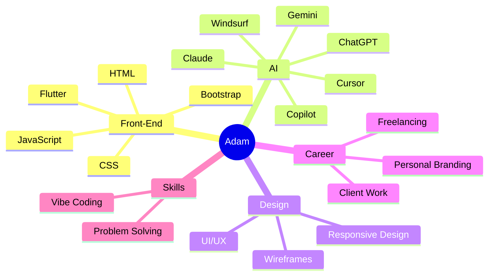

<div align="center">

# 🚀 Adam | Front-End Developer & AI Prompt Engineer

### 🌐 Building Modern Web Experiences with AI

[Portfolio](#) • [LinkedIn](#) • [Email](mailto:adamabdelbarey@gmail.com)

*"Turning ideas into products, one prompt and one pixel at a time."*

### 🎨 Front-End Developer • 🤖 AI Prompt Engineer • 💼 Freelancer • 🧩 Problem Solver • ⚡ Vibe Coder

</div>

---

# 👋 Hello World!

Hey there! I'm **Adam**, a Front-End Developer and AI Prompt Engineer passionate about building beautiful user experiences and leveraging AI to create smarter workflows.

I enjoy transforming ideas into responsive websites, crafting effective prompts, exploring modern AI tools, and continuously improving my design and development skills.

```python
class Adam:
    def __init__(self):
        self.name = "Adam"
        self.role = "Front End Developer & AI Prompt Engineer"
        self.language_spoken = ["ar_EG", "en_US"]

        self.interests = [
            "Freelancing",
            "UI/UX Design",
            "Problem Solving",
            "Vibe Coding"
        ]

        self.frontend_stack = {
            "technologies": [
                "HTML",
                "CSS",
                "Bootstrap"
            ]
        }

        self.ai_tech_stack = {
            "tools": [
                "ChatGPT",
                "Claude",
                "Gemini",
                "Cursor",
                "Copilot",
                "Windsurf",
                "OpenCode"
            ]
        }

    def say_hi(self):
        print("Let's build something amazing together!")

me = Adam()
me.say_hi()
```

---

# 🛠️ Creative Tech Stack

| Front-End 🌐       | AI Tools 🤖 | Design 🎨         | Productivity ⚡ |
| ------------------ | ----------- | ----------------- | -------------- |
| HTML               | ChatGPT     | UI/UX Design      | Git            |
| CSS                | Claude      | Responsive Design | GitHub         |
| Bootstrap          | Gemini      | Wireframing       | VS Code        |
| JavaScript         | Cursor      | Design Systems    | Notion         |
| Flutter (Learning) | Copilot     | User Experience   | Windows        |
| REST APIs          | Windsurf    | Prototyping       | OpenCode       |

---

# 🌟 Current Focus

* 🤖 Building AI-powered web applications
* 🌐 Creating modern responsive websites
* 🎨 Improving UI/UX design skills
* 💼 Growing my freelancing career
* ⚡ Exploring AI-assisted development
* 📱 Learning Flutter & cross-platform development
* 🚀 Shipping projects faster with AI workflows

---

# 📊 GitHub Analytics

<div align="center">


</div>

---

# 🧠 Growth Areas



---

# 💡 Development Philosophy

I believe great products happen when:

* 🎨 Good design meets clean code
* 🤖 AI enhances creativity instead of replacing it
* 🚀 Simplicity beats complexity
* 📱 User experience comes first
* 🧩 Every problem has an elegant solution

---

# 📫 Let's Connect!

* 💼 Open for freelance opportunities
* 🤖 Interested in AI-powered development
* 🌐 Passionate about Front-End Engineering
* 🎨 Always improving UI/UX skills
* 🤝 Happy to collaborate on exciting projects

---

<div align="center">


**Last Updated:** 2026

</div>
